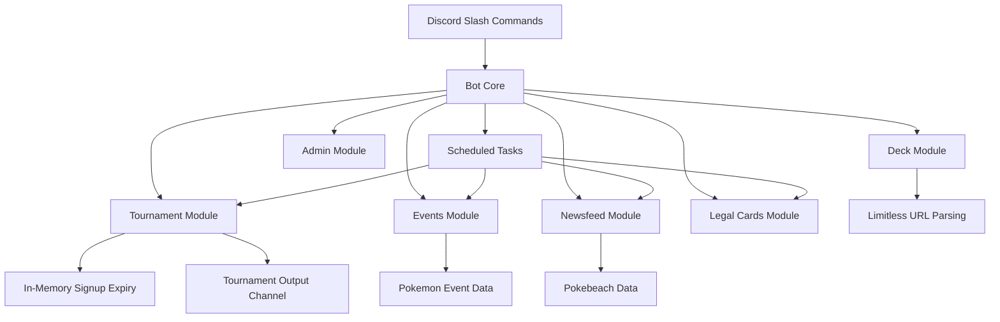

# doms_discord_bot

| Project logo                             |
|:----------------------------------------:|
|          |

A Discord bot that provides TCG news, decklist validation, and tournament
sign-ups, primarily focused on the Pokemon TCG.

[](https://github.com/Dominic-Santos/doms_discord_bot)
[](https://github.com/Dominic-Santos/doms_discord_bot)
[](https://github.com/Dominic-Santos/doms_discord_bot)
[](LICENSE)

## Table of Contents

- [About The Project](#about-the-project)
- [Quick Start](#quick-start)
- [How to Use the Bot](#how-to-use-the-bot)
- [Role-Based Commands](#role-based-commands)
- [Commands](#commands)
- [Tournament Signup Window Behavior](#tournament-signup-window-behavior)
- [Timed Tasks](#timed-tasks)
- [Configuration Reference](#configuration-reference)
- [Operational Notes](#operational-notes)
- [Troubleshooting](#troubleshooting)
- [Architecture](#architecture)
- [Create Your Own Bot](#create-your-own-bot)

## About The Project

This passion project was created to provide better tools and automation for my
local game store. As a Pokemon Professor (Judge), I found the official tools
to be severely lacking. To help address those shortcomings, I developed this
bot to keep the community informed and streamline everyday operations, from
deck checks to tournament sign-ups and more.

Who this is for:

- Store organizers and staff managing local events
- Judges validating decklists quickly
- Players submitting tournament sign-ups with saved decks or URLs

## Quick Start

1. Install requirements:

```sh
pip install -r requirements.txt
```

1. Create your config:

```json
{
    "app_token": "your_discord_app_token",
    "admin_password": "your_admin_password",
    "maintenance_mode": false
}
```

1. Run the bot:

```sh
python main.py
```

1. Quick verification commands:

- `/about`
- `/admin maintenance check`
- `/admin pokemon test_tournament_channel`

## How to Use the Bot

### Installation

Click
[this install link](https://discord.com/oauth2/authorize?client_id=1398430497947779182)
to install DomsBot on your server.

Or create your own bot and add it to your server by following the
[Create Your Own Bot](#create-your-own-bot) section.

## Role-Based Commands

Some commands are intended for server administrators only. It is recommended to
restrict command access based on server roles through your server integration
settings.

Admin command groups:

- `/admin`
- `/newsfeed`
- `/events`

User command groups:

- `/help`
- `/about`
- `/deck`
- `/tournament`

## Commands

### General

| Command | Required Role | Parameters | Description |
| --- | --- | --- | --- |
| `/help` | User | - | Opens the documentation link. |
| `/about` | User | - | Shows bot info and creator details. |

### Admin - Maintenance

| Command | Required Role | Parameters | Description |
| --- | --- | --- | --- |
| `/admin maintenance check` | Admin | - | Check whether maintenance mode is on or off. |
| `/admin maintenance toggle` | Admin | `password` | Toggle maintenance mode. |

### Admin - Tournament Window

| Command | Required Role | Parameters | Description |
| --- | --- | --- | --- |
| `/admin tournament open_signups` | Admin | `expire_datetime`, `password` | Open sign-ups until the provided expiration datetime. |
| `/admin tournament status` | Admin | - | Show the current in-memory sign-up expiration. |

### Admin - Pokemon

| Command | Required Role | Parameters | Description |
| --- | --- | --- | --- |
| `/admin pokemon set_tournament_channel` | Admin | - | Set current channel as tournament output channel. |
| `/admin pokemon test_tournament_channel` | Admin | - | Send a test message to the tournament output channel. |
| `/admin pokemon update_legal_cards` | Admin | - | Refresh legal cards used for validation. |
| `/admin pokemon update_banned_cards` | Admin | - | Refresh banned cards used for validation. |
| `/admin pokemon update_signup_sheet` | Admin | - | Refresh tournament sign-up sheet image. |

### Events - Pokemon

| Command | Required Role | Parameters | Description |
| --- | --- | --- | --- |
| `/events pokemon follow_premier` | Admin | - | Follow premier events. |
| `/events pokemon unfollow_premier` | Admin | - | Stop following premier events. |
| `/events pokemon follow_store` | Admin | `guid` | Follow events for a store GUID. |
| `/events pokemon unfollow_store` | Admin | `guid` | Stop following events for a store GUID. |
| `/events pokemon unfollow_all` | Admin | - | Stop following all events. |
| `/events pokemon sync` | Admin | - | Sync followed events into Discord scheduled events. |
| `/events pokemon delete_all` | Admin | - | Cancel bot-created Discord events in the server. |
| `/events pokemon set_channel` | Admin | - | Set channel for event update notifications. |
| `/events pokemon remove_channel` | Admin | - | Remove event update notification channel. |

### Newsfeed - Pokemon

| Command | Required Role | Parameters | Description |
| --- | --- | --- | --- |
| `/newsfeed pokemon set_channel` | Admin | - | Set channel for newsfeed updates. |
| `/newsfeed pokemon update` | Admin | - | Fetch latest newsfeed posts now. |
| `/newsfeed pokemon disable` | Admin | - | Disable newsfeed updates for this server. |

### Deck - Pokemon

| Command | Required Role | Parameters | Description |
| --- | --- | --- | --- |
| `/deck pokemon check_url` | User | `limitless_url` | Validate a Limitless deck URL. |
| `/deck pokemon check` | User | `name` | Validate a saved deck by name. |
| `/deck pokemon create` | User | `name`, `limitless_url` | Save deck and run validation. |
| `/deck pokemon delete` | User | `name` | Delete saved deck. |
| `/deck pokemon list` | User | - | List saved decks. |
| `/deck pokemon info` | User | `name` | Show details and validation state of a saved deck. |

### Tournament - Pokemon Standard

| Command | Required Role | Parameters | Description |
| --- | --- | --- | --- |
| `/tournament pokemon_standard signup` | User | `name`, `pokemon_id`, `year_of_birth`, `deck_name` | Sign up with a saved deck (Standard path). |
| `/tournament pokemon_standard signup_url` | User | `name`, `pokemon_id`, `year_of_birth`, `limitless_url` | Sign up with a Limitless URL (Standard path). |

### Tournament - Pokemon Expanded

| Command | Required Role | Parameters | Description |
| --- | --- | --- | --- |
| `/tournament pokemon_expanded signup` | User | `name`, `pokemon_id`, `year_of_birth`, `deck_name` | Sign up with a saved deck (Expanded path). |
| `/tournament pokemon_expanded signup_url` | User | `name`, `pokemon_id`, `year_of_birth`, `limitless_url` | Sign up with a Limitless URL (Expanded path). |

## Tournament Signup Window Behavior

The tournament signup window is controlled by admin commands and checked before
deck validation in tournament sign-up commands.

Admin control:

- `/admin tournament open_signups {expire_datetime} {password}`
- `/admin tournament status`

Datetime format:

- Uses Python ISO parsing, example: `2026-05-21 18:30:00`
- Timezone-aware ISO datetimes are accepted and converted to local server time

Important runtime behavior:

- The expiration value is stored in memory only
- It is not read from `config.json`
- It is not persisted to `config.json`
- It resets to `None` when the bot restarts

User-facing responses after expiration:

- If up to 1 day late: `tournament sign ups are closed`
- If more than 1 day late:
  `no tournaments are being held at this moment`

## Timed Tasks

The bot includes scheduled tasks that run automatically.

| Task | Schedule | Purpose |
| --- | --- | --- |
| Update legal cards | Daily at 7:00 | Refresh legal card data for validation. |
| Update banned cards | Daily at 8:00 | Refresh banned card data for validation. |
| Update sign-up sheet | Daily at 9:00 | Refresh tournament sign-up sheet image. |
| Update events | Daily at 11:00 | Sync latest followed event data. |
| Check newsfeed | Every 6 hours | Fetch latest Pokemon newsfeed posts. |

## Configuration Reference

| Key | Required | Type | Default | Description |
| --- | --- | --- | --- | --- |
| `app_token` | Yes | string | none | Discord bot token from Discord Developer Portal. |
| `admin_password` | Yes | string | `abc123` | Password for admin-protected commands. |
| `maintenance_mode` | No | boolean | `true` | Whether the bot starts in maintenance mode. |

Config example:

```json
{
    "app_token": "app_token_placeholder",
    "admin_password": "123abc",
    "maintenance_mode": true
}
```

## Operational Notes

- Maintenance mode affects multiple command groups and scheduled jobs.
- Tournament sign-up checks happen before deck validation in tournament flows.
- Event and newsfeed features rely on configured output channels.
- Schedule times are based on server runtime local time.

## Troubleshooting

Common issues and quick fixes:

- Invalid admin password
  - Verify `admin_password` in `config.json` and command input.
- Tournament output channel is not set for this server
  - Run `/admin pokemon set_tournament_channel` in the desired channel.
- Tournament output channel not found. Please set it again.
  - Channel may have been deleted or permissions changed. Re-run set command.
- Sign-up sheet is not available. Please try again later.
  - Run `/admin pokemon update_signup_sheet`.
- Legal cards are not loaded. Please try again later.
  - Run `/admin pokemon update_legal_cards`.
- No tournament sign-ups are currently open.
  - Run `/admin tournament open_signups` with an expiration datetime.

## Architecture



## Create Your Own Bot

If you would like to run your own version of the bot, feel free to fork or
copy the code from this repository.

### Discord App

Create a Discord application by following the
[official Discord developer guide](https://discord.com/developers/docs/intro).

The bot needs permissions to post messages and manage scheduled events.

### Configure the App

Create a `config.json` file in the project root using the configuration
reference above.

### Install Requirements

```sh
pip install -r requirements.txt
```

### Run the Bot

```sh
python main.py
```
